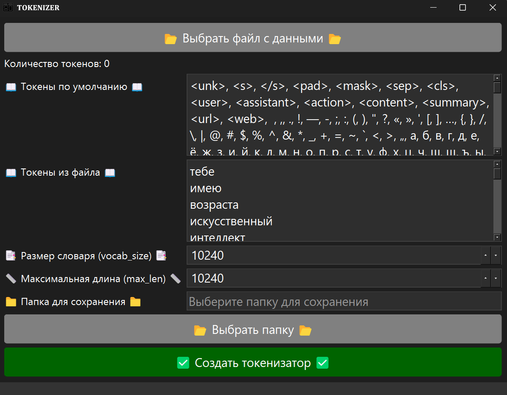

# GUI_GPT_2
Скрипты с графическим интерфейсом, создания токенизатора, создания модели, обучения модели, проверка модели.
#
Создания токенизатора + txt!!!
#

#
Создания токенизатора.

#
Создания токенизатора из txt.
#

#
Создание модели.
#

#
Обучение модели.
#

#
Чат с моделью.
#

#
Чат с моделью поддерживает контекст.
#

